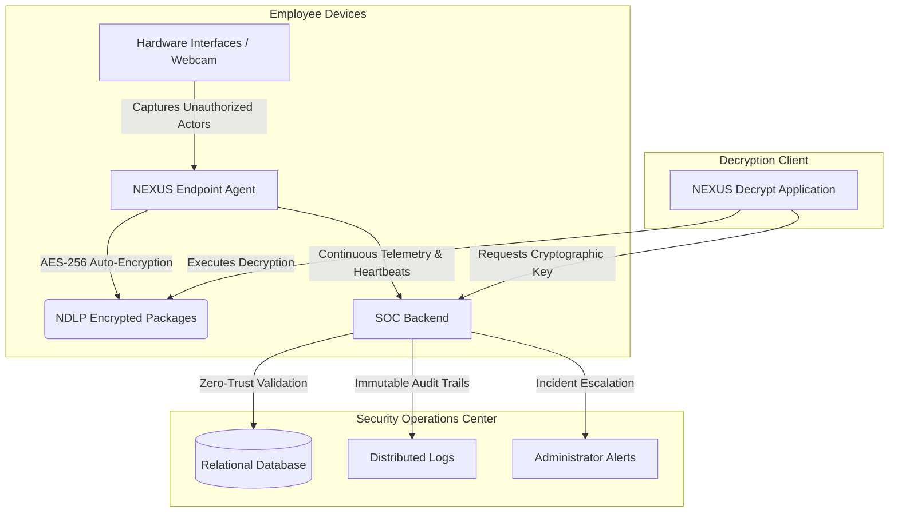
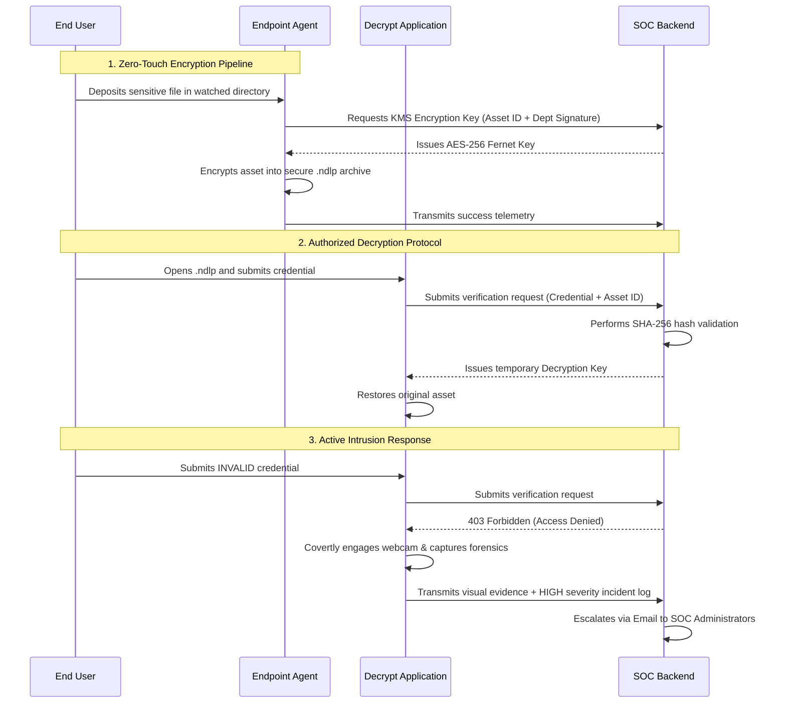

# NEXUS Secure DLP (Data Loss Prevention)


NEXUS Secure DLP is an enterprise-grade Endpoint Security and Data Loss Prevention platform. It is engineered to prevent unauthorized data exfiltration, ensure cryptographic file integrity in transit, and provide a centralized Security Operations Center (SOC) for continuous endpoint monitoring, auditing, and automated threat response.

## 🏗️ System Architecture



The NEXUS architecture is built on a robust, multi-layered security model:

### 1. Endpoint Layer (`nexus_agent/`)
A lightweight, high-performance background daemon deployed across employee endpoints.
- **Continuous File Monitoring:** Actively watches critical directories and USB volumes, instantly encrypting exposed sensitive assets.
- **Device Control & Telemetry:** Establishes secure websocket/HTTP connections to transmit system heartbeats, telemetry, and security events.
- **Hardware Integration:** Interfaces with native webcam drivers to capture visual evidence of unauthorized access attempts.

### 2. Application Layer (`user_app/`)
A secure, sandboxed Desktop GUI application providing authorized personnel with seamless file access.
- **Cryptographic Operations:** Handles the secure decoding and reconstruction of `.ndlp` (NEXUS Data Loss Prevention) archives.
- **Identity Verification:** Interfaces with the SOC Backend to negotiate decryption keys via strict password and token validation.

### 3. Server Layer (`server/`)
The centralized Security Operations Center (SOC) backend governing the entire deployment.
- **SOC Dashboard:** A real-time command center for threat analytics, active endpoint tracking, and incident response.
- **Access Management System:** Provides granular administrative controls to authorize, quarantine, or permanently block endpoint devices.
- **Key Management Service (KMS):** Securely generates, stores, and issues AES-256 `Fernet` keys based on strict department-level authorization checks.

### 4. Data & Audit Layer (`server/data/`)
- **Immutable Logging:** Maintains a blockchain-inspired, tamper-evident chronological ledger of all network and file events.
- **Relational Database:** Securely stores hashed credentials (`SHA-256`) and department policies.

---

## 🛡️ Core Security Capabilities

### Security & Identity Layer
- **Authentication:** Zero-trust device enrollment and session validation.
- **Authorization:** Department-based Access Control (RBAC) ensuring users only decrypt files within their clearance.
- **Encryption Engine:** Utilizes AES-256 symmetric encryption via the `cryptography.fernet` framework.
- **Integrity Validation:** Cryptographic hashing prevents `.ndlp` package tampering.

### Monitoring & Detection Layer
- **Intrusion Detection:** Heuristics to detect brute-force attempts and invalid decryption passwords.
- **Visual Forensics:** Covert webcam capture system activated instantly upon unauthorized access.
- **Real-Time Tracking:** Sub-second logging of file state changes and data movements.

### Alert & Incident Response Layer
- **Severity Classification:** Automated triage assigning LOW, MEDIUM, or HIGH severity scores to all telemetry.
- **Automated Escalation:** Immediate dispatch of SMTP email alerts complete with forensic photo attachments for HIGH-severity incidents.

---

## 🔒 Threat Mitigation Workflow



### Flow Breakdown
1. **Encryption Flow:** Files dropped into secured zones are instantly detected. The agent negotiates a symmetric key with the SOC KMS and encrypts the payload, preventing data leaks via USB or unauthorized transfer.
2. **Decryption Flow:** Authorized personnel use the Decrypt Application to authenticate. Upon successful SOC validation, the temporary key is injected into memory to restore the file.
3. **Unauthorized Access Handling:** Failed authentications are treated as active threats. The client is denied access while simultaneously capturing visual forensics and reporting the breach to the SOC.
4. **Logging & Alert Pipeline:** The SOC logs the breach into the immutable ledger and dispatches an emergency email alert to administrators containing the incident details and intruder photograph.

---

## 📈 Scalability & Deployment
NEXUS Secure DLP is built with a highly modular, decoupled architecture. The Flask-based SOC Backend and lightweight Python agents are designed to scale effortlessly, supporting deployments from a single sensitive workstation to hundreds of distributed enterprise endpoints.

---

## 🚀 Quick Start Guide

### Prerequisites
- Python 3.10+
- Virtual Environment

### 1. Initialize SOC Backend
```bash
source .venv/bin/activate
cd server
python server.py
```
> **SOC Dashboard:** `http://127.0.0.1:5050` | **Default Admin Password:** `Arnab@2026`

### 2. Deploy Endpoint Agent
```bash
source .venv/bin/activate
cd nexus_agent
python main.py
```

### 3. Launch Decrypt Application
```bash
source .venv/bin/activate
cd user_app
python app.py
```

### ⚙️ Server Configuration
Configure the `.env` variables to enable the full Alert & Response layer:
- `EMAIL_ENABLED=true`
- `EMAIL_SENDER=security@yourdomain.com`
- `EMAIL_PASSWORD=your_smtp_app_password`
- `EMAIL_RECEIVER=soc_admin@yourdomain.com`
- `SECRET_KEY=your_secure_flask_key`
